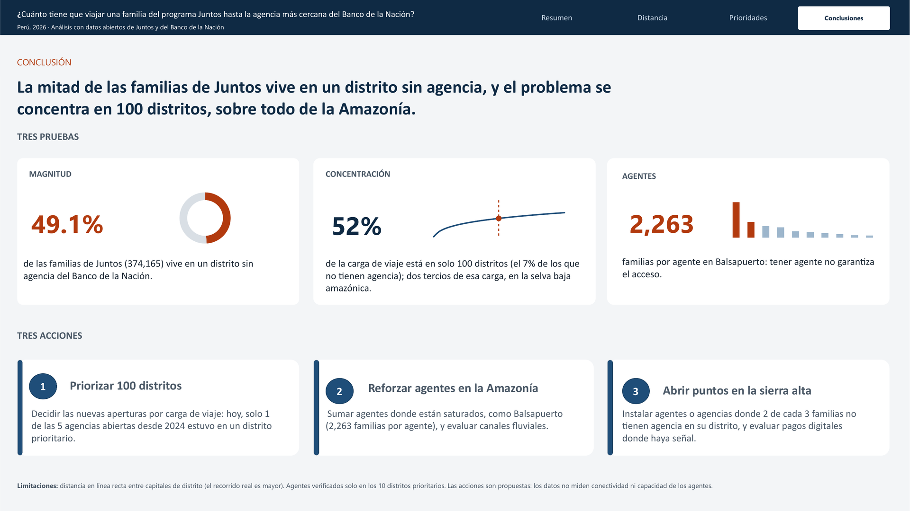
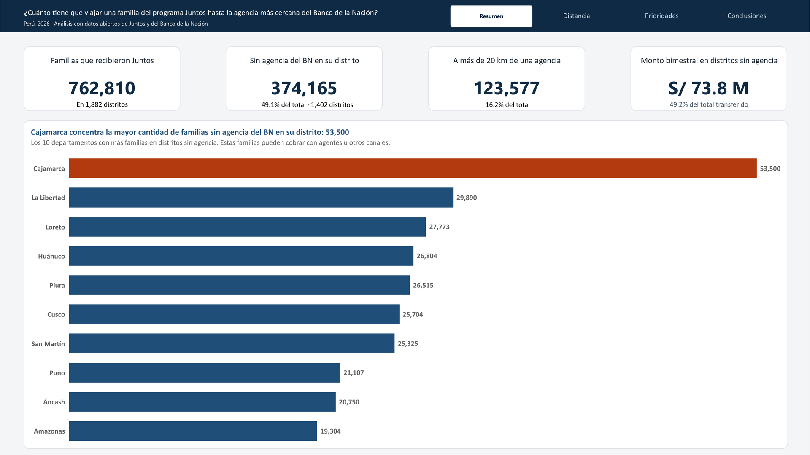
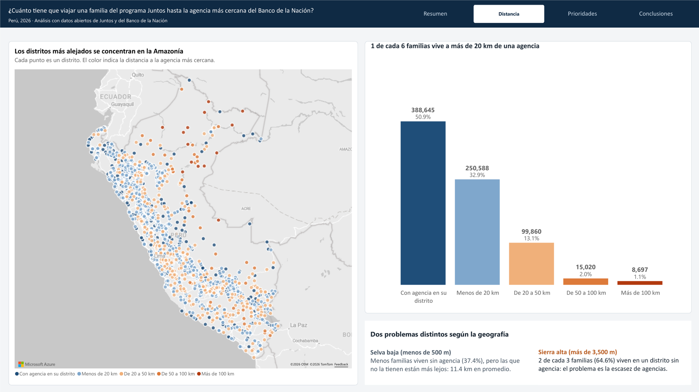
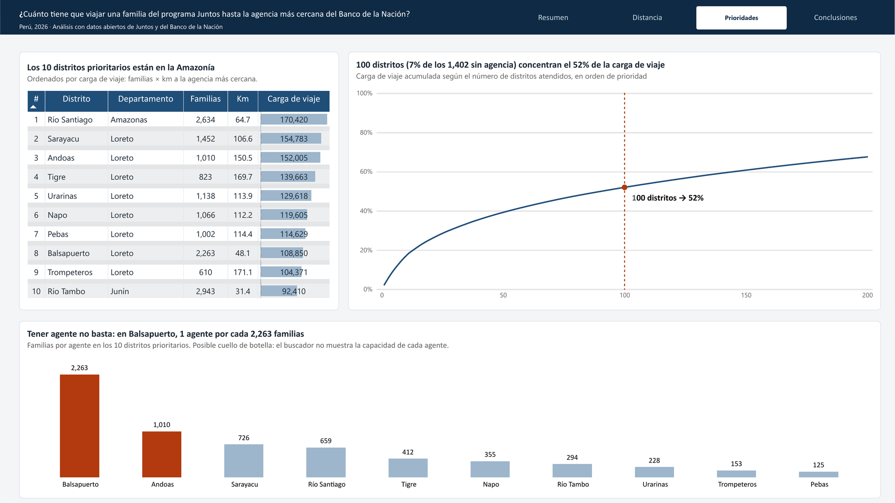

# ¿Cuánto tiene que viajar una familia del programa Juntos hasta la agencia más cercana del Banco de la Nación?

**Perú, 2026 · Análisis con datos abiertos · SQL Server · Power BI**



## En una frase

**La mitad de las familias de Juntos (49.1%) vive en un distrito sin agencia del Banco de la Nación, y el problema se concentra en 100 distritos, sobre todo de la Amazonía.**

---

## Dashboard

| Resumen | Distancia |
|---|---|
|  |  |
| **Prioridades** | **Conclusiones** |
|  |  |

Archivo de Power BI: [descargar `juntos_banco_nacion.pbix`](https://github.com/jeanpierrecs/juntos-banco-nacion/raw/main/pbix/juntos_banco_nacion.pbix)

## Contexto

Juntos es un programa del Ministerio de Desarrollo e Inclusión Social (MIDIS) que entrega transferencias bimestrales a familias en situación de pobreza con gestantes, niños o adolescentes. Las familias reciben el dinero en una cuenta del Banco de la Nación y lo cobran en agencias, cajeros, agentes o ventanillas móviles.

Una agencia es el único canal donde se pueden hacer todos los trámites (abrir una cuenta, reponer una tarjeta, presentar un reclamo). Este proyecto mide **qué tan lejos están las familias de Juntos de la agencia más cercana**, y propone **dónde convendría instalar nuevos puntos de atención**.

Aunque el caso es el Banco de la Nación, el método es el mismo que usa cualquier banco para planificar su red de agencias y agentes: cruzar dónde está la demanda con dónde está la oferta.

## Preguntas

**Pregunta principal:** ¿Cuánto tiene que viajar una familia del programa Juntos hasta la agencia más cercana del Banco de la Nación, y dónde conviene instalar nuevos puntos de atención?

1. ¿Qué distritos concentran más familias que reciben transferencias de Juntos, y por qué montos?
2. ¿Cuántas de esas familias viven en distritos sin agencia del Banco de la Nación?
3. ¿A qué distancia está la agencia más cercana, y cómo cambia según la geografía?
4. ¿Qué 10 distritos deberían priorizarse para instalar un punto de atención?
5. **Validación:** de esos 10, ¿cuántos ya tienen agentes?

## Hallazgos

**1. Casi la mitad de las familias vive en un distrito sin agencia.**
De las 762,810 familias que recibieron Juntos en el bimestre IV de 2026, **374,165 (49.1%)** viven en uno de los 1,402 distritos sin agencia del Banco de la Nación. Cada bimestre, **S/ 73.8 millones** (49.2% de lo transferido) llegan a esas familias.

**2. Una de cada seis familias vive a más de 20 km de una agencia.**

| Distancia a la agencia más cercana | Familias | % |
|---|---|---|
| Con agencia en su distrito | 388,645 | 50.9% |
| Menos de 20 km | 250,588 | 32.9% |
| De 20 a 50 km | 99,860 | 13.1% |
| De 50 a 100 km | 15,020 | 2.0% |
| Más de 100 km | 8,697 | 1.1% |

La geografía muestra dos problemas distintos: en la **selva baja**, menos familias viven sin agencia (37.4%), pero las que no la tienen están más lejos (11.4 km en promedio); en la **sierra alta** (más de 3,500 m), 2 de cada 3 familias (64.6%) viven en un distrito sin agencia.

**3. El problema está concentrado: 100 distritos explican el 52% de la carga de viaje.**
Para priorizar se usó la **carga de viaje** (familias × km a la agencia más cercana), el mismo criterio que en logística se usa para medir el esfuerzo de transporte. Los primeros 100 distritos (7% de los que no tienen agencia) concentran el **52%** de la carga total. Dos tercios de esa carga está en la selva baja amazónica, y Loreto aporta 28 de esos distritos.

| Primeros distritos atendidos | % de la carga de viaje |
|---|---|
| 10 | 17.0% |
| 50 | 39.3% |
| 100 | 52.0% |
| 200 | 67.6% |

**4. Los 10 distritos prioritarios están en la Amazonía, y tener agente no basta.**

| # | Distrito | Departamento | Familias | Km | Agentes | Familias por agente |
|---|---|---|---|---|---|---|
| 1 | Río Santiago | Amazonas | 2,634 | 64.7 | 4 | 659 |
| 2 | Sarayacu | Loreto | 1,452 | 106.6 | 2 | 726 |
| 3 | Andoas | Loreto | 1,010 | 150.5 | 1 | 1,010 |
| 4 | Tigre | Loreto | 823 | 169.7 | 2 | 412 |
| 5 | Urarinas | Loreto | 1,138 | 113.9 | 5 | 228 |
| 6 | Napo | Loreto | 1,066 | 112.2 | 3 | 355 |
| 7 | Pebas | Loreto | 1,002 | 114.4 | 8 | 125 |
| 8 | Balsapuerto | Loreto | 2,263 | 48.1 | 1 | 2,263 |
| 9 | Trompeteros | Loreto | 610 | 171.1 | 4 | 153 |
| 10 | Río Tambo | Junín | 2,943 | 31.4 | 10 | 294 |

Los 10 tienen al menos un agente, así que las familias pueden cobrar sin viajar hasta la agencia. Pero la carga es muy desigual: en **Balsapuerto, un solo agente tendría que atender a 2,263 familias**, mientras que en Pebas cada agente atiende a 125. Es un posible cuello de botella: el buscador del banco muestra cuántos agentes hay, no su capacidad.

**5. Las aperturas recientes no siguieron este criterio.**
Entre junio de 2024 y junio de 2026, cinco distritos ganaron una agencia. Con el ranking calculado sobre la red de 2024, solo **Sepahua (puesto 22)** estaba entre los 100 prioritarios; los otros cuatro estaban entre los puestos 359 y 705. En el mismo periodo se cerró la agencia de Rázuri (La Libertad). El banco decide aperturas por muchas razones (demanda comercial, pedidos municipales, seguridad); este análisis solo muestra que no siguieron el criterio de carga de viaje de las familias de Juntos.

## Recomendaciones

1. **Priorizar 100 distritos:** decidir las nuevas aperturas por carga de viaje. Hoy, solo 1 de las 5 agencias abiertas desde 2024 estuvo en un distrito prioritario.
2. **Reforzar agentes en la Amazonía:** sumar agentes donde están saturados, como Balsapuerto (2,263 familias por agente), y evaluar canales fluviales.
3. **Abrir puntos en la sierra alta:** instalar agentes o agencias donde 2 de cada 3 familias no tienen agencia en su distrito, y evaluar pagos digitales donde haya señal.

Son propuestas: los datos no miden la conectividad ni la capacidad real de cada agente.

## Datos

| Fuente | Contenido | Periodo |
|---|---|---|
| [MIDIS – Programa Juntos](https://www.datosabiertos.gob.pe/group/programa-nacional-de-apoyo-directo-los-m%C3%A1s-pobres-juntos-juntos) | Hogares afiliados, abonados y montos transferidos por distrito | 2024 a 2026 (16 bimestres) |
| [Banco de la Nación – Agencias](https://www.datosabiertos.gob.pe/dataset/relacion-de-agencias-y-oficinas-especiales-nivel-nacional-banco-de-la-naci%C3%B3n-bn) | Agencias y oficinas por distrito | Junio de 2024, 2025 y 2026 |
| [Códigos equivalentes de ubigeo](https://www.datosabiertos.gob.pe/dataset/codigos-equivalentes-de-ubigeo-del-peru) | Distritos, altitud y superficie | 1,893 distritos |
| [COMPLETAR: fuente de la tabla de centros poblados] | Coordenadas de las capitales de distrito | 1,874 capitales |
| Google Maps (manual) | Coordenadas de 18 distritos creados recientemente | Octubre de 2026 |
| [Banco de la Nación – Agentes](https://www.bn.com.pe/canales-atencion/agentes-nivel-nacional.asp) | Agentes en los 10 distritos prioritarios (revisión manual) | Octubre de 2026 |

Todas las fuentes son públicas. Los archivos originales no se incluyen en el repositorio por su tamaño; se descargan desde los enlaces.

## Método

```
Datos abiertos  →  Power Query  →  SQL Server  →  Power BI
(descarga)         (limpieza y      (cruces,         (dashboard)
                    exportación)     distancias,
                                     ranking)
```

1. **Preparación (Power Query):** unión de los archivos de Juntos y de agencias, ubigeo como texto de 6 dígitos y normalización de encabezados.
2. **Carga y validación (SQL Server, scripts 00 y 01):** conversión de formatos regionales y 7 controles de calidad (conteos, duplicados, rango de coordenadas y cruces sin pareja).
3. **Tabla base y distancias (script 02):** una fila por distrito con familias, montos y agencias. La distancia a la agencia más cercana se calcula con el tipo `geography` de SQL Server entre capitales de distrito.
4. **Hallazgos (scripts 03 a 05):** distribución por distancia, carga de viaje, ranking, análisis de Pareto y evaluación de aperturas 2024-2026.
5. **Validación de campo:** revisión manual de agentes en los 10 distritos prioritarios.

**Definiciones clave**
- **Familias:** hogares abonados (que recibieron la transferencia) en el bimestre IV de 2026.
- **Distrito sin agencia:** distrito sin agencia ni oficina del Banco de la Nación en junio de 2026. Sus familias pueden cobrar con agentes u otros canales.
- **Carga de viaje:** familias × km a la agencia más cercana, solo en distritos sin agencia.

## Limitaciones

- La distancia se mide en **línea recta entre capitales de distrito**. El recorrido real, por carretera o por río, es mayor, así que los resultados son un mínimo.
- Los **agentes** solo se pueden consultar en un buscador web, sin archivo descargable; por eso se verificaron a mano únicamente en los 10 distritos prioritarios.
- No se incluyen **ventanillas móviles** ni datos de **conectividad**, por falta de fuentes públicas.
- Los distritos se analizan como unidad: no se mide la ubicación de cada familia dentro de su distrito.
- Tres distritos nuevos (Ninabamba, San Antonio y Santa Lucía) usan coordenadas aproximadas dentro de su provincia. Su efecto en los resultados es mínimo.

## Calidad de datos

Durante el proyecto se documentaron 15 observaciones de calidad (archivos acumulados, coordenadas corruptas en la fuente, montos alterados por el formato regional, entre otras), cada una con su impacto y su solución. Ver [`docs/registro_calidad.md`](docs/registro_calidad.md).

## Estructura del repositorio

```
juntos-banco-nacion/
├── README.md
├── data/
│   └── clean/          → coordenadas_manual.csv, TB_UBIGEOS-2_limpio.csv
├── sql/                → scripts 00 a 05, en orden de ejecución
├── pbix/               → juntos_banco_nacion.pbix
├── img/                → capturas del dashboard
└── docs/
    └── registro_calidad.md
```

## Cómo reproducirlo

1. Descargar las fuentes de la sección **Datos**.
2. Preparar los archivos con Power Query y exportarlos a CSV.
3. Crear la base `JuntosBN` en SQL Server e importar los CSV.
4. Ejecutar los scripts de `sql/` en orden (00 a 05).
5. Abrir `pbix/juntos_banco_nacion.pbix` y actualizar la conexión a SQL Server.

---

**Autor:** Jean Pierre Castañeda Silva · Analista de Datos y BI · [LinkedIn](https://www.linkedin.com/in/jeanpierrecs)
